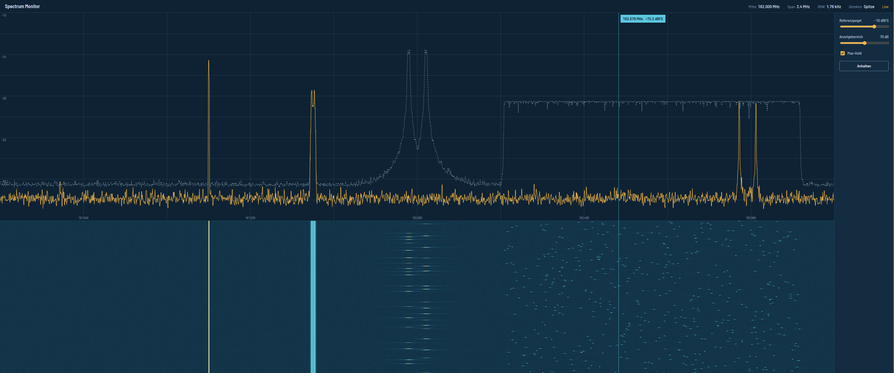

# Spectrum Monitor



*Oben das Live-Spektrum (gelb) mit Max-Hold (gestrichelt), unten der Wasserfall.
Max-Hold macht sichtbar, was im Momentbild fehlt: die beiden AIS-Kanäle in der
Mitte und den gesamten Bereich, den der Frequenzspringer rechts belegt.*

Echtzeit-Spektrumüberwachung in Rust: IQ-Samples rein, Spektrum und Wasserfall
live im Browser. Heute mit einem Signalsimulator für das AIS-Band um 162 MHz,
später mit echtem Empfang über einen RTL-SDR.

## Starten

```bash
cargo run --release
# dann http://127.0.0.1:8080 öffnen
```

Optionen: `--fft-size 4096` (feinere Auflösung), `--fps 30`,
`--detector avg|peak`, `--seed 7` (anderes Signalszenario), `--bind 0.0.0.0:8080`.

```bash
cargo test   # DSP-Tests: Frequenzlage, dBFS-Kalibrierung, Detektorverhalten
```

## Architektur

```
IqSource (Trait)  ──►  SpectrumEstimator  ──►  broadcast-Kanal  ──►  WebSocket  ──►  Browser
 Simulator             Hann, FFT, Welch        (langsame Clients     Metadaten      Spektrum,
 später RTL-SDR        dBFS, fftshift          überspringen Frames)  + f32-Frames   Wasserfall, Marker
```

- `src/source.rs`: `IqSource`-Trait und Simulator. Der Simulator erzeugt einen
  Dauerträger, ein FM-Signal, einen Frequenzspringer und FSK-Bursts auf beiden
  AIS-Kanälen (161,975 und 162,025 MHz), dazu Rauschen.
- `src/dsp.rs`: Spektrumschätzung. Ein komplexer Ton mit Amplitude 1 ergibt
  0 dBFS. Der Detektor `peak` hält kurze Bursts sichtbar, `avg` glättet das Rauschen.
- `src/server.rs`: Axum-Server mit WebSocket. Pro Frame ein Binärpaket mit
  `f32`-Werten, Little Endian.
- `src/main.rs`: Erfassungsschleife in eigenem Thread. Sie verarbeitet pro Frame
  genau die Samples, die in 1/fps Sekunden anfallen, damit keine Signalzeit verloren geht.
- `web/index.html`: Oberfläche ohne Build-Schritt, wird ins Binary eingebettet.

## Roadmap

1. **Spektrum und Wasserfall** mit Simulator ✔
2. **RTL-SDR als Quelle** hinter demselben Trait, Mittenfrequenz im Browser umschaltbar
3. **AIS-Dekodierung**: GMSK-Demodulation, NMEA-Parsing, Schiffe auf einer Karte
4. **Signaldetektion und Klassifikation**: CFAR-Detektor, Modulationsklassifikation
   per ONNX-Modell (Training in Python, Inferenz in Rust), Ereignisprotokoll
5. **Frontend in Leptos** (Rust/WASM) statt JavaScript
